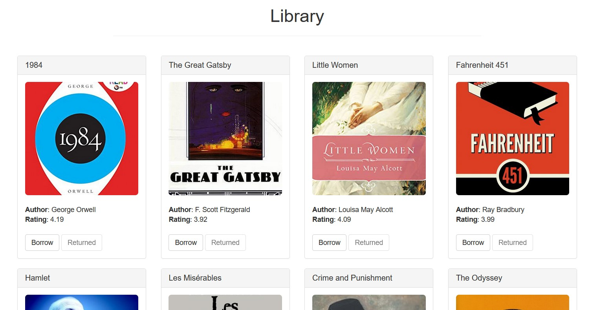
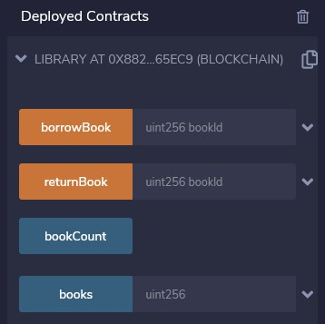
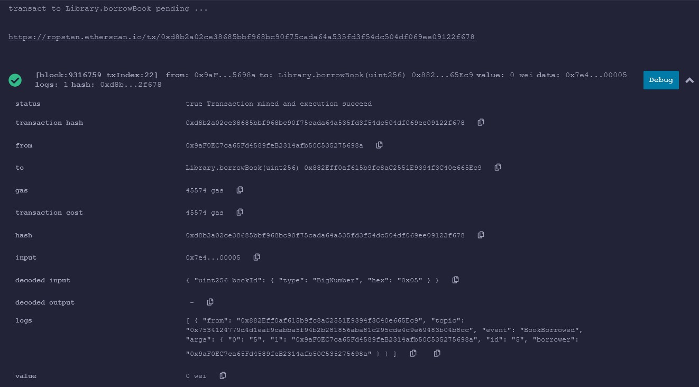
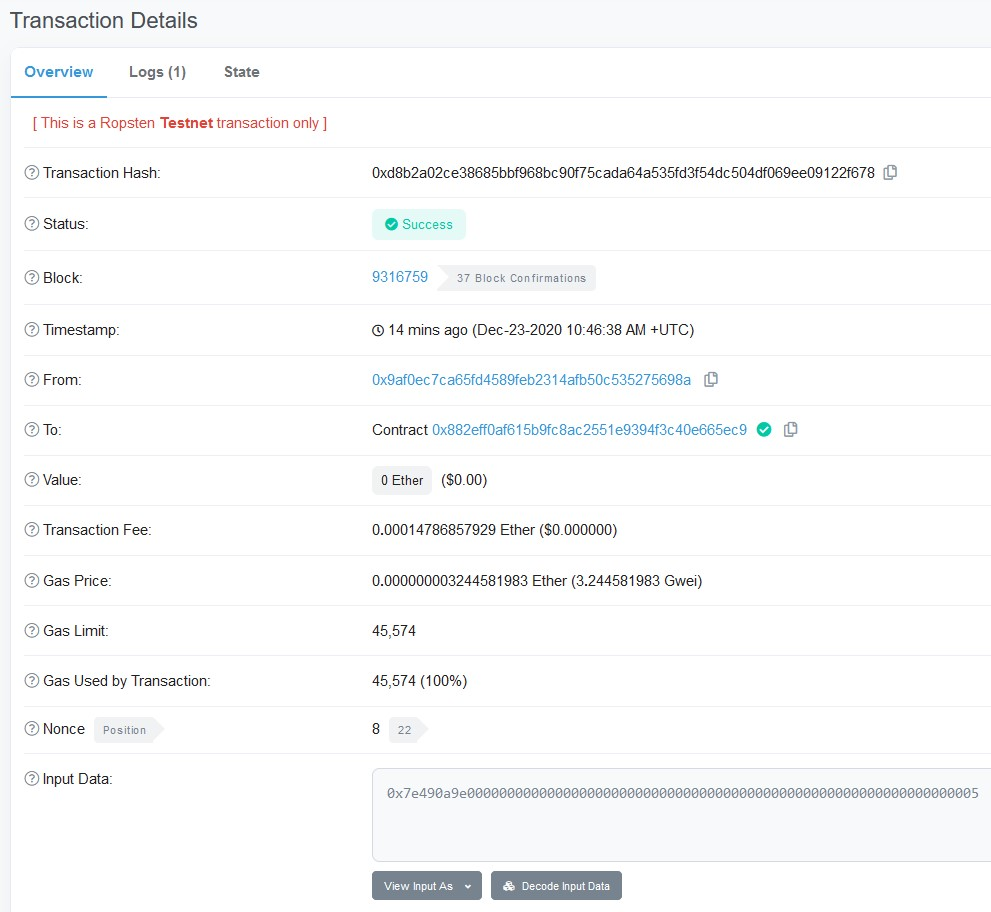
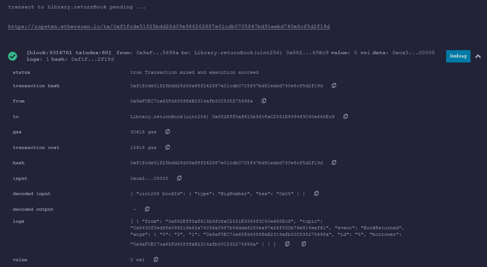
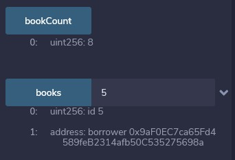

# Library DAPP

Decentralized application with Ethereum smart contracts for borrowing books from a library.

Used Solidity, Metamask plugin, Truffle, Web3.js frameworks.

## Features

1. Borrowing and returning a book by signing a smart contract

2. Only the person who borrowed the book is allowed to return it

3. Borrowed books are locked for borrowing until they are returned

## Installation and execution

1. Install [npm](https://www.npmjs.com/), [Ganache](https://www.trufflesuite.com/ganache) and [Metamask](https://chrome.google.com/webstore/detail/metamask/nkbihfbeogaeaoehlefnkodbefgpgknn?hl=en).

2. Create a new Ganache block chain that runs on local 8545 port.

3. Download and unzip the latest release of this repository

4. Navigate to the directory of the release

5. Install dependencies using `npm install`

6. Launch the application by typing `npm run dev`

7. Log into your testnet Metamask account or create a new one

8. If you wallet is empty, get some test Ethereum from online faucets, i.e. [Ropsten](https://faucet.ropsten.be/)

9. Click on a book you want to borrow or return and confirm the transaction using Metamask

## User interface

## Logs

Compiled with [Remix](https://remix.ethereum.org/), deployed on Ropsten Testnet.

### All available calls on Remix

### Borrowing a book

Same transaction, but viewed on [Etherscan](https://ropsten.etherscan.io/).

### Returning a book

### Retrieving the book count and a single book

